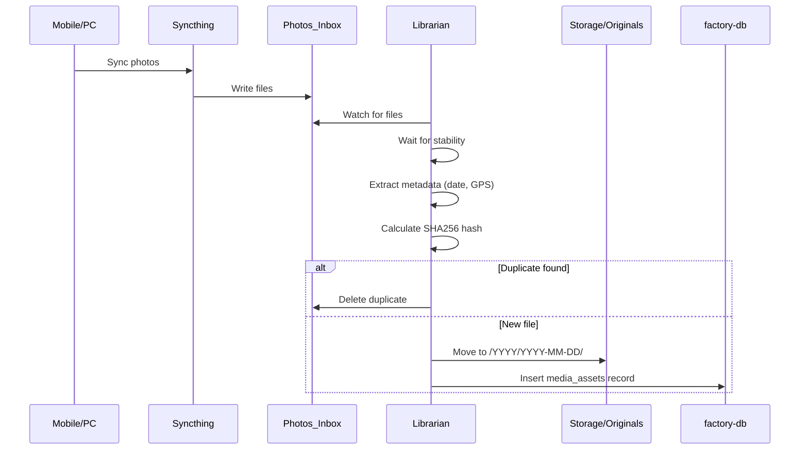
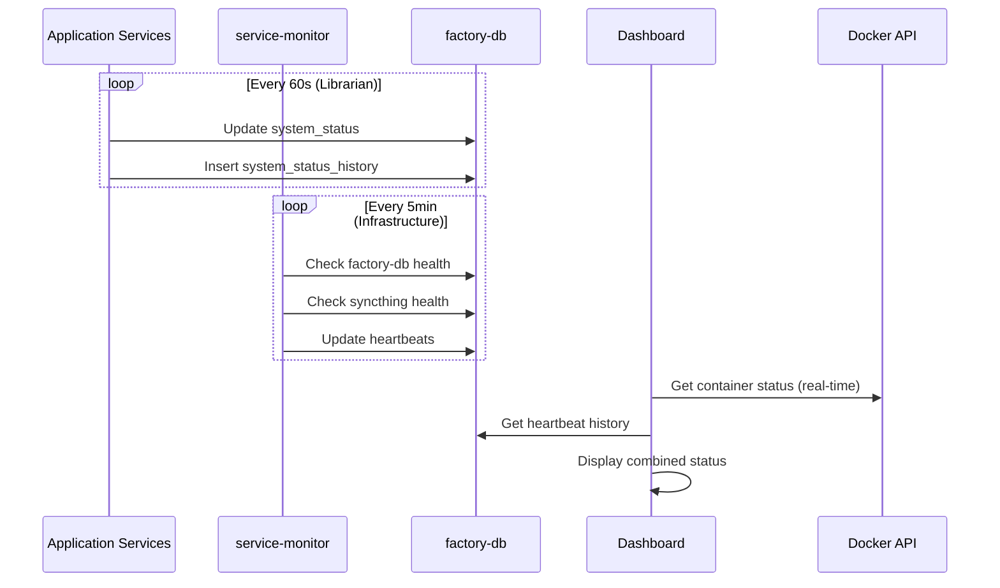

# Architecture

**Last Updated:** 2026-01-03  
**Purpose:** System design and data flow for Photo Factory

---

## System Overview

```
┌─────────────────────────────────────────────────────────────────────────────────┐
│                              PHOTO FACTORY                                       │
├─────────────────────────────────────────────────────────────────────────────────┤
│                                                                                  │
│  ┌──────────────┐    ┌─────────────────┐    ┌──────────────────────────────────┐│
│  │   DEVICES    │    │  PHOTOS_INBOX   │    │       STORAGE/ORIGINALS          ││
│  │  (Phone/PC)  │───▶│  (Drop Zone)    │───▶│   /{YYYY}/{YYYY-MM-DD}/          ││
│  └──────────────┘    └─────────────────┘    └──────────────────────────────────┘│
│        │                     │                              │                    │
│        │                     ▼                              ▼                    │
│        │             ┌───────────────┐              ┌───────────────┐           │
│        │             │  LIBRARIAN    │              │  FACTORY-DB   │           │
│        └────────────▶│  (Ingestion)  │─────────────▶│  (PostgreSQL) │           │
│       Syncthing      └───────────────┘              └───────────────┘           │
│                              │                              │                    │
│                              ▼                              ▼                    │
│                      ┌───────────────┐              ┌───────────────┐           │
│                      │  SERVICE-     │              │  DASHBOARD    │           │
│                      │  MONITOR      │─────────────▶│  (Streamlit)  │           │
│                      └───────────────┘              └───────────────┘           │
│                                                                                  │
└─────────────────────────────────────────────────────────────────────────────────┘
```

---

## Data Flow

### 1. File Ingestion Pipeline



### 2. Heartbeat Monitoring Flow



---

## Module Structure

### Project Layout

```
Photo_Factory/
├── .cursor/                    # Memory Bank (AI context)
│   ├── memory/                 # Long-term context
│   └── active_sprint/          # Short-term state
├── Src/                        # Source code (Git tracked)
│   ├── Librarian/              # Photo ingestion service
│   │   ├── librarian.py        # Main entry point
│   │   ├── file_watcher.py     # File system monitoring
│   │   ├── metadata_extractor.py # EXIF/date extraction
│   │   ├── collision_handler.py  # Duplicate detection
│   │   ├── heartbeat.py        # Librarian-specific heartbeat
│   │   ├── utils.py            # Path resolution, logging
│   │   ├── Dockerfile          # Container definition
│   │   └── tests/              # Pytest test suite
│   ├── Dashboard/              # Monitoring dashboard
│   │   ├── dashboard.py        # Streamlit application
│   │   ├── Dockerfile          # Container definition
│   │   └── tests/              # Dashboard tests
│   └── Shared/                 # Common components
│       ├── models.py           # SQLAlchemy models
│       ├── database.py         # DB connection & init
│       ├── heartbeat_service.py # Shared heartbeat class
│       ├── service_monitor.py  # Infrastructure monitoring
│       └── tests/              # Shared component tests
├── Stack/                      # Infrastructure (Git tracked)
│   └── App_Data/               # Docker configs
│       ├── docker-compose.yml  # Service orchestration
│       ├── factory-db-data/    # PostgreSQL data (Git ignored)
│       └── syncthing_config/   # Syncthing config
├── Photos_Inbox/               # Drop zone (Git ignored)
├── Storage/                    # Vault (Git ignored)
│   └── Originals/              # Organized by date
├── docs/                       # Documentation
│   ├── DATABASE_SCHEMA.md      # CANONICAL schema definition
│   └── *.md                    # Other docs
├── requirements.txt            # Python dependencies
└── README.md                   # Project overview
```

---

## Service Responsibilities

### Librarian Service

**Purpose:** Automated photo/video ingestion and organization

**Responsibilities:**
- Watch `Photos_Inbox/` for new files
- Extract metadata (capture date, GPS coordinates)
- Calculate SHA256 hash for duplicate detection
- Organize files into `Storage/Originals/{YYYY}/{YYYY-MM-DD}/`
- Record metadata in `media_assets` table
- Report heartbeat every 60 seconds

**Key Components:**
| Component | File | Purpose |
|-----------|------|---------|
| Entry Point | `librarian.py` | Service orchestration |
| File Watching | `file_watcher.py` | Stability checks, event handling |
| Metadata | `metadata_extractor.py` | EXIF date/location extraction |
| Collision | `collision_handler.py` | Hash calculation, duplicate detection |
| Utilities | `utils.py` | Path resolution, logging setup |
| Heartbeat | `heartbeat.py` | Librarian heartbeat wrapper |

### Dashboard Service

**Purpose:** Real-time monitoring and observability

**Responsibilities:**
- Display service health status
- Show container status via Docker API
- Display heartbeat information from database
- Show media asset statistics
- Display recent processed files
- Show service logs

**Key Features:**
- Auto-refresh (configurable interval)
- Service selector for focused views
- Combined Docker + heartbeat status display

### Service Monitor

**Purpose:** Infrastructure heartbeat tracking

**Responsibilities:**
- Monitor non-Python services (syncthing, factory-db)
- Update heartbeats for infrastructure services
- Run independently as background process

### Shared Components

**Purpose:** Reusable code across services

| Component | File | Purpose |
|-----------|------|---------|
| Models | `models.py` | SQLAlchemy table definitions |
| Database | `database.py` | Connection pool, session management |
| Heartbeat | `heartbeat_service.py` | Thread-based heartbeat updates |
| Cleanup | `cleanup_script.py` | Historical data retention |

---

## Database Schema

### Tables

#### `media_assets`
- **Purpose:** Media asset ledger
- **Key Columns:** `file_hash`, `original_name`, `final_path`, `captured_at`, `location`
- **Status Flags:** `is_ingested`, `is_geocoded`, `is_thumbnailed`, `is_backed_up`, `has_errors`

#### `system_status`
- **Purpose:** Fast-lookup current service status
- **Key Columns:** `service_name`, `last_heartbeat`, `status`, `current_task`

#### `system_status_history`
- **Purpose:** Historical heartbeat time-series
- **Key Columns:** `service_name`, `status`, `heartbeat_timestamp`
- **Retention:** 60 days

See `docs/DATABASE_SCHEMA.md` for canonical definitions.

---

## Design Patterns

### 1. Separation of Concerns
- **Originals:** Immutable source of truth (never modified)
- **Derivatives:** Processed files (can be regenerated)
- **Database:** Metadata only (not file content)

### 2. Status Flags Pattern
- Boolean flags track processing pipeline stages
- Each service sets its own flag when complete
- Timestamps record when each stage completed
- Enables queue queries: `WHERE is_X = FALSE`

### 3. Dual Heartbeat Strategy
- **Real-time:** Docker API for container status
- **Historical:** Database for heartbeat history
- Dashboard combines both for complete view

### 4. Graceful Degradation
- File processing continues if database unavailable
- Dashboard shows partial data if services offline
- Services log errors but don't crash

---

## Path Resolution

All code uses **relative paths** per `.cursorrules`:

```python
# Good - relative to __file__
BASE_DIR = Path(__file__).parent.parent.parent
STORAGE_PATH = BASE_DIR / "Storage" / "Originals"

# Bad - absolute paths (BANNED)
STORAGE_PATH = Path("D:/Photo_Factory/Storage/Originals")  # NEVER
```

Exception: `.env` file may contain absolute paths for Docker volume mounts.

---

## Health & Monitoring

### Health Checks

| Service | Check Type | Interval |
|---------|------------|----------|
| factory-db | `pg_isready` | 10s |
| librarian | Process alive | 2m |
| dashboard | Process alive | 2m |
| syncthing | HTTP /8384 | 2m |
| service-monitor | Process alive | 2m |

### Heartbeat Intervals

| Service | Interval | Source |
|---------|----------|--------|
| librarian | 60s | Self-reporting |
| dashboard | 5min | Self-reporting |
| factory-db | 5min | service-monitor |
| syncthing | 5min | service-monitor |

---

## Future Architecture (Planned)

```
┌──────────────────────────────────────────────────────────────────────────┐
│                        FUTURE SERVICES                                    │
├──────────────────────────────────────────────────────────────────────────┤
│                                                                           │
│  ┌────────────┐  ┌────────────┐  ┌────────────┐  ┌────────────┐         │
│  │ Geocoding  │  │ Thumbnail  │  │   Face     │  │  Backup    │         │
│  │  Service   │  │  Service   │  │ Detection  │  │  Service   │         │
│  └────────────┘  └────────────┘  └────────────┘  └────────────┘         │
│        │               │               │               │                 │
│        ▼               ▼               ▼               ▼                 │
│  is_geocoded=T   is_thumbnailed=T  (new flag)    is_backed_up=T         │
│                                                                           │
└──────────────────────────────────────────────────────────────────────────┘
```

Each future service:
1. Queries for unprocessed records (flag = FALSE)
2. Processes the asset
3. Updates the flag to TRUE
4. Reports heartbeat

---

**END OF ARCHITECTURE**


